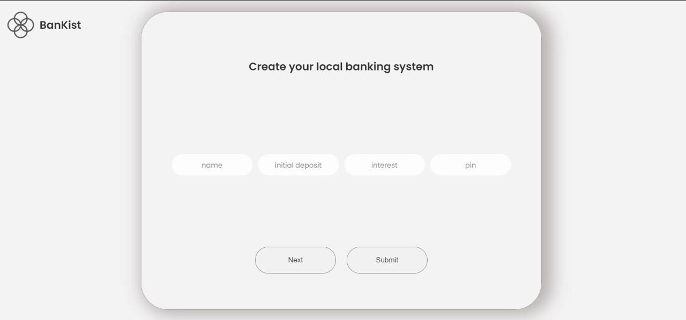
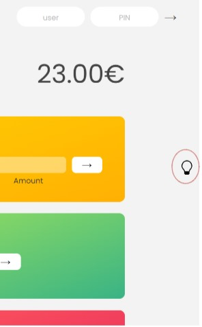

# Bankist - Minimalist Banking



Bankist is a minimalist banking web application that allows users to create a localized database of accounts with unique PINs. Users can perform various banking operations seamlessly within this simple yet effective platform.

## Features

### 1. Transfer Money

Easily transfer money from one account to another with a few simple clicks. Bankist ensures a smooth and secure transaction process.

### 2. Loan Management

Users can request a loan based on a specific condition (At least one of the deposited amounts must be more than 10% of the loan). The application evaluates the request and facilitates the loan process accordingly.

### 3. Account Closure

Close an account effortlessly through Bankist. The user-friendly interface guides users through the account closure process, making it quick and convenient.

## How to Use

1. **Create an Account**: Start by creating a new account with a initial deposit and unique PIN.
2. **Transfer Money**: Navigate to the transfer section to send money to another account.
3. **Loan Request**: If eligible, request a loan based on the provided conditions.
4. **Close Account**: When needed, close an account securely using the account closure feature.

## The Bulb Icon



As this is a solely localised system, only one user is desired to use this site and access multiple accounts by logging into different accounts observing debits and credits of each account (just to understand how this works). In order to ensure user-friendliness, the bulb account shows all the usernames along with their pins.

## Getting Started

To get started with Bankist, follow these steps:

1. Clone the repository:
   ```bash
   git clone https://github.com/AnindoChoudhury/Bankist.git
   ```
